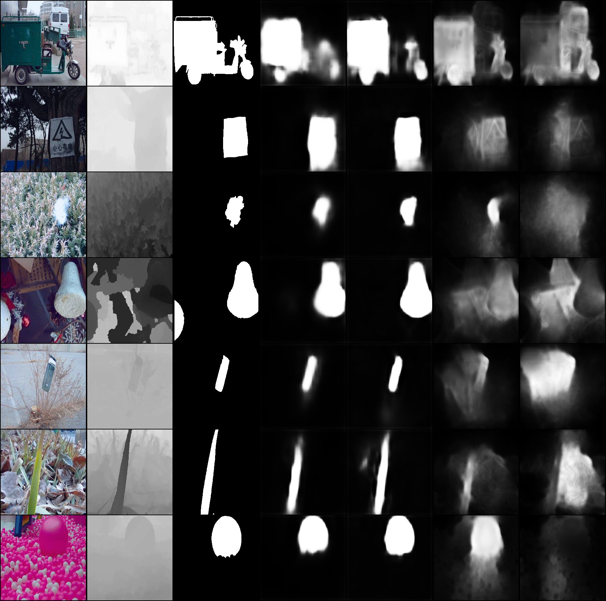

# Approach to improve RGB-based Salient Object Detection using Depth Information and Knowledge Distillation
2021년 한국지능정보시스템학회 추계 학술대회 우수 논문상 ([website](http://www.kiiss.or.kr/conference/conf/sub05.html))

## Author
* [JinHong Min](https://github.com/alswlsghd320)
* [Eunbi Park](https://github.com/bluvory)
* Hongju Lee



Paper: *<upload later>*<br>

Abstract: <br>
*.*

## Requirements
```.bash
#For Anaconda
conda env create -f environment_cuda11_1.yml # For CUDA 11.1
```

## Training
We train our models with NJU2K, SIP, DUT-RGBD/train

```.bash
'''
KIISS2021/
  ㄴdatasets/
        ㄴDUT-RGBD/
        ㄴLFSD/
        ㄴNJU2K/
        ㄴSIP/
        ...
  ㄴmodels/
  ...
'''
# For Train Teacher Network
python train_rgbd.py --args

# For Train Student Network Only
python train_rgb.py --args

# For Train Student Network with Knowledge Distillation
python train_kd.py --args
```

The results are placed in `run/<RUNNING_TIME>/<tensorboard>`. 

## Test

We train our models with SSD, LFSD, STEREO-1000, DUT-RGBD/test

```.bash
# For test
python test.py --path <model_path> --model <PoolNet or BASNet or u2net> --dataset <test_dataset> ...
```

## Results
[table1] [result figure]

## Citation

## Contact us
If you have any questions, please contact us [JinHong Min](alswlsghd320@naver.com)
